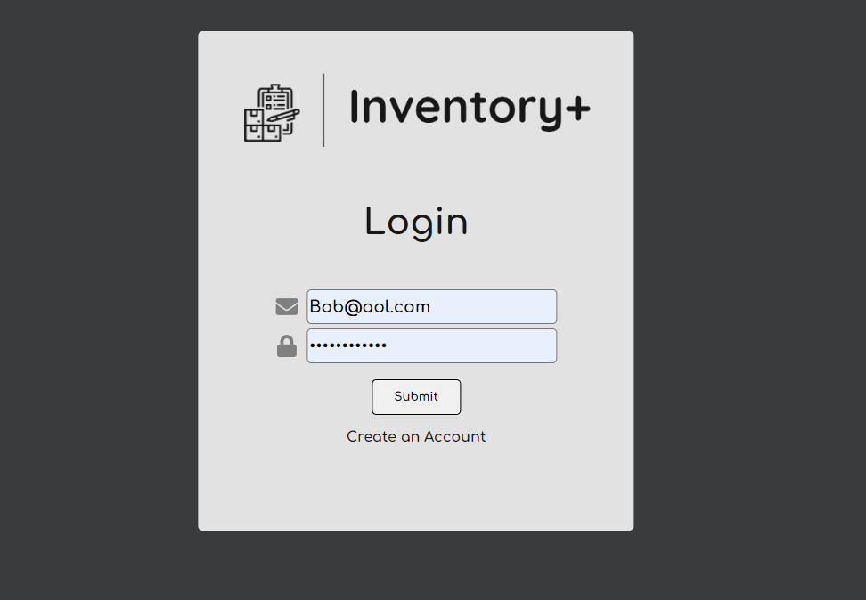
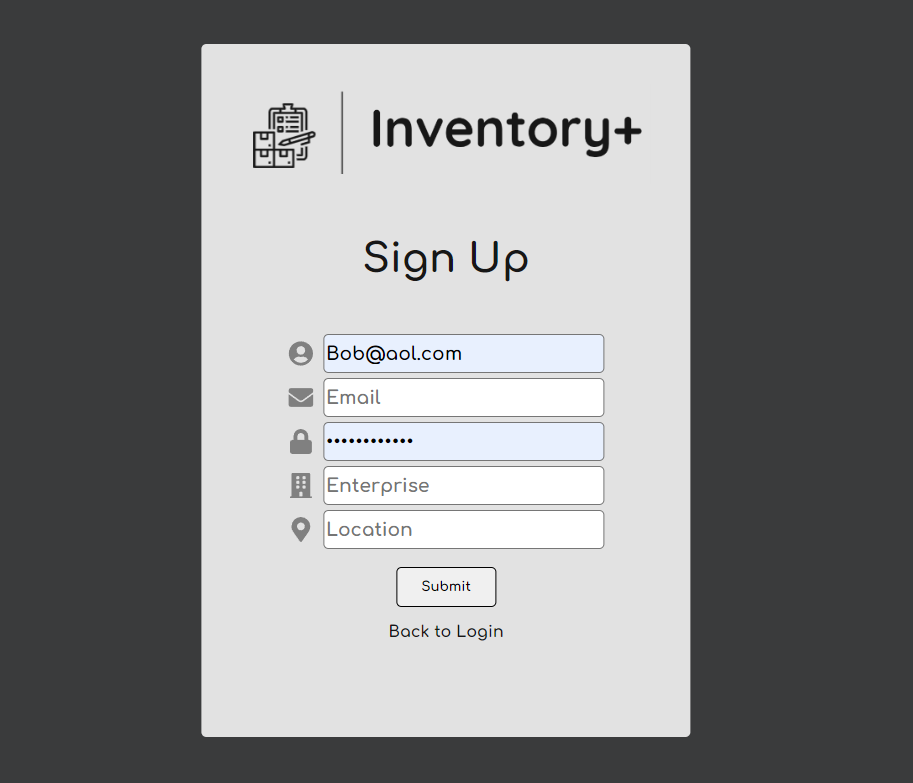
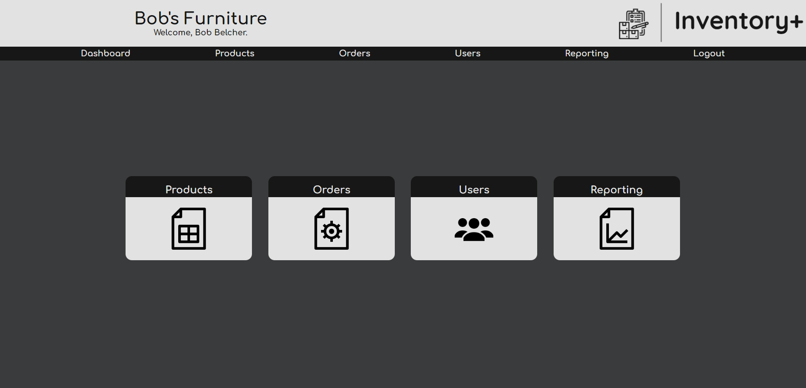
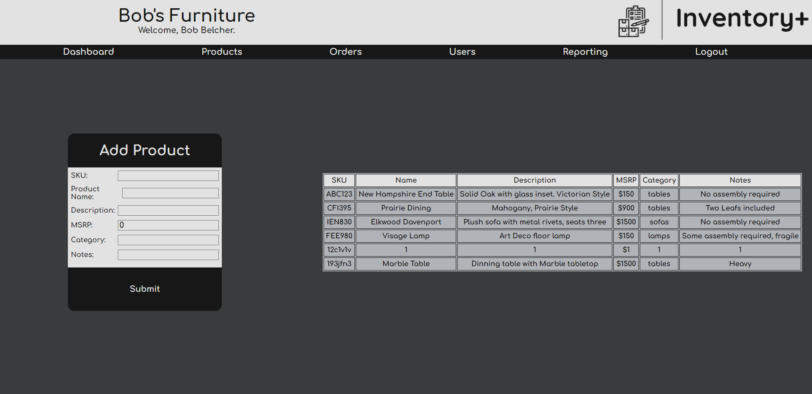
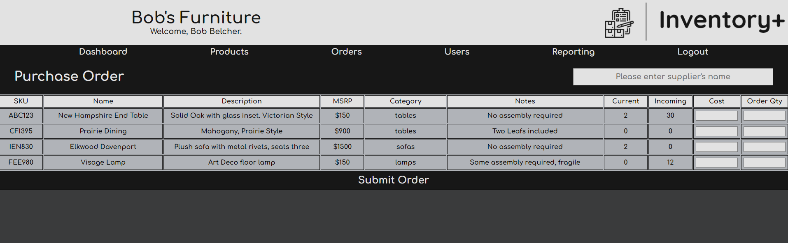
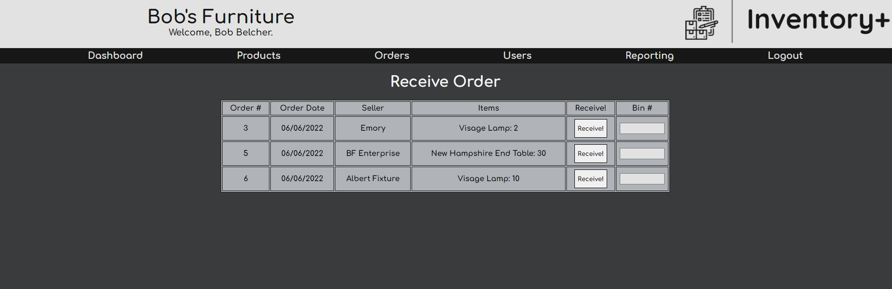
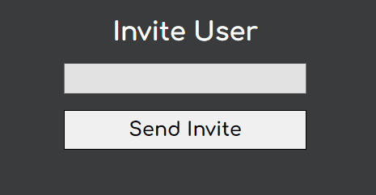
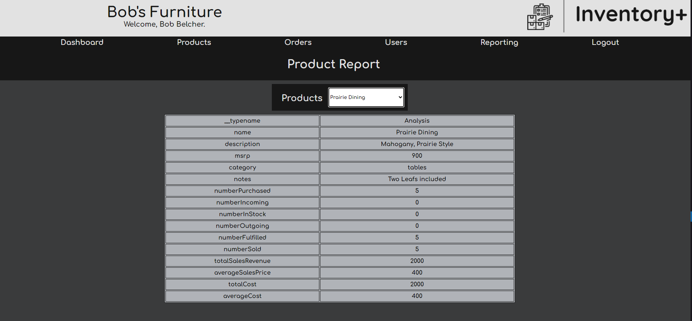

# Inventory+
   
  ## Table of Contents:
  [Description](#description) 
  [Usage](#usage) 
  [Contributing](#contributing) 
  [Tests](#tests) 
  [License](#license) 
  [Questions](#questions) 

  # Description
  Inventory+ is an inventory management system that will help your business keep track of products, order, and sales. 
  Here is the live link: [Inventory+](https://inventoryplus.herokuapp.com/)
  ### User Login
   

  ### User Signup
   

  ### User Dashboard
   

  ### Add Products
   

  ### Purchase Order
   

  ### Receive Order
   

  ### Invite Users
   

  ### Product Report
   

  # Usage
  Inventory+ is free to use currently, register your business, and start tracking!
  # Contributing
  If you wish to contribute please fork the repository first.
  # Tests
  Testing not yet implemented.
  # License
  [The MIT license](https://opensource.org/licenses/MIT)
  
    Copyright 2022 Bret, Joe, Aaron, Carolyn
    
    Permission is hereby granted, free of charge, to any person obtaining a copy of this software and associated documentation files (the "Software"), to deal in the Software without restriction, including without limitation the rights to use, copy, modify, merge, publish, distribute, sublicense, and/or sell copies of the Software, and to permit persons to whom the Software is furnished to do so, subject to the following conditions:
    
    The above copyright notice and this permission notice shall be included in all copies or substantial portions of the Software.
    
    THE SOFTWARE IS PROVIDED "AS IS", WITHOUT WARRANTY OF ANY KIND, EXPRESS OR IMPLIED, INCLUDING BUT NOT LIMITED TO THE WARRANTIES OF MERCHANTABILITY, FITNESS FOR A PARTICULAR PURPOSE AND NONINFRINGEMENT. IN NO EVENT SHALL THE AUTHORS OR COPYRIGHT HOLDERS BE LIABLE FOR ANY CLAIM, DAMAGES OR OTHER LIABILITY, WHETHER IN AN ACTION OF CONTRACT, TORT OR OTHERWISE, ARISING FROM, OUT OF OR IN CONNECTION WITH THE SOFTWARE OR THE USE OR OTHER DEALINGS IN THE SOFTWARE.
  # Questions
  ### GitHub Username: [Banger484](https://github.com/Banger484) 
  ### Email Address:   Banger484@gmail.com 
  If you have any additional questions, you send an email to the address provided above.
